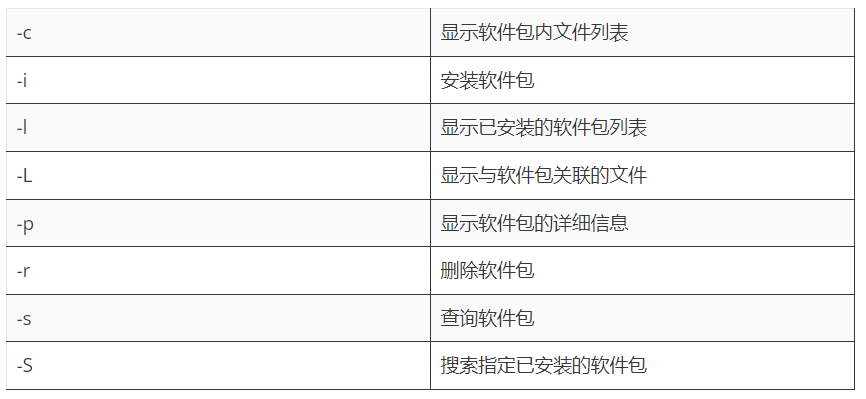
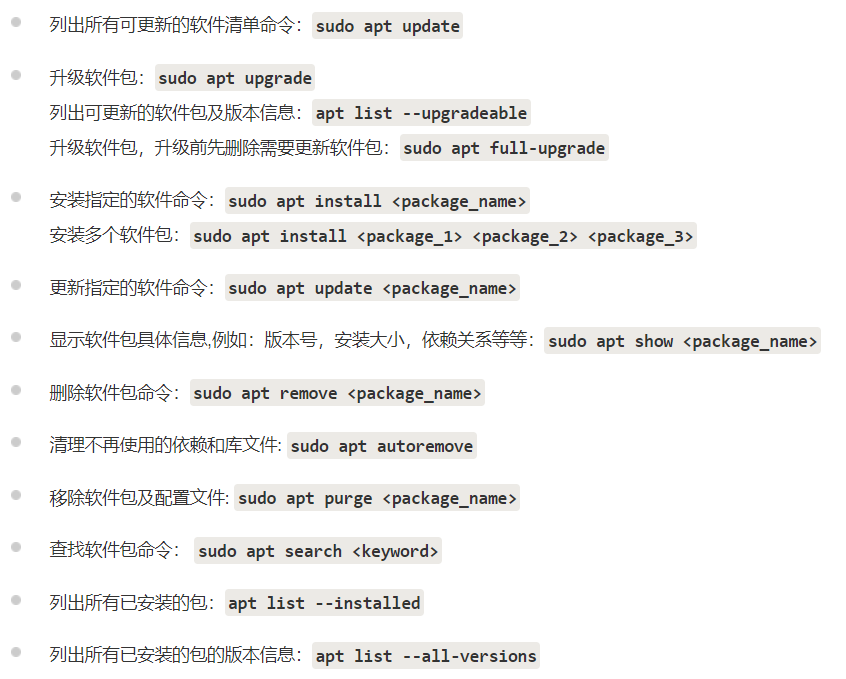

## linux-ubuntu

1. 软件包管理

   - dbkg -- 源代码包

     

   - apt  -- 网络安装软件包及依赖并安装（/etc/apt/sources.list）

     

   - 关机
   
     - 关机：`sudo shutdown -h now`
     - 重启：`sudo shutdown -r now`
     - whoani pwd date
     - ls cd cat mkdir rm mv  
   

